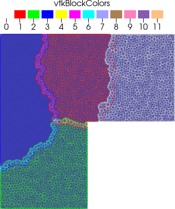
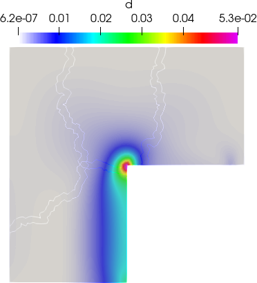

## L-shape cracking ##

This tutorial involves cracking of L shaped specimen, where loading is controled by a point boundry condition.


### Preprocessing ###

You can either solver the problem using vectorial approach (recomemned) or using staggered approach. To generate the solver use either from below.

- Generation of solver (vectorial)

```bash
PSD_PreProcess -dimension 2 -problem damage -model hybrid-phase-field \
-dirichletconditions 1 -dirichletpointconditions 1 -debug -postprocess ud \
-energydecomp -constrainHPF -vectorial -getreactionforce -plotreactionforce \
-reactionforce variational-based
```

- Gnerating solver (staggerred)

```bash
PSD_PreProcess -dimension 2 -problem damage -model hybrid-phase-field \
-dirichletconditions 1 -dirichletpointconditions 1 -debug -postprocess ud \
-energydecomp -constrainHPF -getreactionforce -plotreactionforce \
-reactionforce variational-based
```


### Edit Cycle ###

**Edit ControlParameter.edp:**

- Update physical parameter, change
```c++
  real lambda = 121.15e3 ,                                                    
       mu     = 80.77e3  ,                                                    
       Gc     = 2.7      ; 
```

to

```c++
  real lambda = 6.16e3   ,                                                    
       mu     = 10.95e3  ,                                                    
       Gc     = 8.9e-2   ; 
```
- Update solver parameter , change
```c++
  real lfac  = 2.0  ,                                                         
       maxtr = 7e-3 ,                                                         
       tr    = 1e-5 ,                                                         
       dtr   = 1e-5 ,                                                         
       lo           ; 
```
to
```c++
  real lfac  = 2.0  ,                                                         
       maxtr = 1    ,                                                         
       tr    = 1e-2 ,                                                         
       dtr   = 1e-2 ,                                                         
       lo           ; 
```
- Enter the correct Point boundary condition, change
```c++
  real[int,int] PbcCord = [                                                   
//-------------------- [  x  , y  ] --------------------//                   
                       [  0. , 0. ]    // point 0                       
//------------------------------------------------------//                    
                      ];                                                      
                                                                              
   macro Pbc0Ux  -0. //                                                 
   macro Pbc0Uy  -0. //
```
to 
```c++
  real[int,int] PbcCord = [                                                   
//-------------------- [  x  , y  ] --------------------//                   
                       [  470., 250. ]    // point 0                       
//------------------------------------------------------//                    
                      ];                                                      
                                                                              
   macro Pbc0Uy  tr //
```

**Edit VariationalFormulation.edp:**

- Remove the pre-cracked Dirichlet from VariationalFormulation, delete these lines if present in the script
```c++
    //--------------------------------------------------------------------------                
    //  $\forall x\in\partial\Omega_D u=ug: ug\to\mathbb R$                               
    //--------------------------------------------------------------------------                
    + on(4,u2 = 1)                          // Cracked (Dirichlet) 
```


**Edit LinearFormBuilderAndSolver.edp:**

- To postprocess correct reaction forces in LinearFormBuilderAndSolver.edp for vectorial solver, change
```
  for(int i=0; i < Th.nv; i++){                                                 
     if(abs(Th(i).y-1.)<.000001){                                               
        forcetotx = forcetotx + F[][i*3]*DP[i*3];           
        forcetoty = forcetoty + F[][i*3+1]*DP[i*3+1];       
     }                                                                          
  } 
```
to
```
  if(mpirank==mpirankPCi[0]){
     forcetotx = forcetotx + F[][PCi[0]*3+0]*DP[PCi[0]*3+0];           
     forcetoty = forcetoty + F[][PCi[0]*3+1]*DP[PCi[0]*3+1]; 
  } 
```

- To postprocess correct reaction forces in LinearFormBuilderAndSolver.edp for staggered solver, change

```
  for(int i=0; i < Th.nv; i++){                                                 
     if(abs(Th(i).y-1.)<.000001){                                               
        forcetotx = forcetotx + F[][i*2]*DP[i*2];           
        forcetoty = forcetoty + F[][i*2+1]*DP[i*2+1];       
     }                                                                          
  }
```

to

```
  if(mpirank==mpirankPCi[0]){
     forcetotx = forcetotx + F[][PCi[0]*2+0]*DP[PCi[0]*2+0];           
     forcetoty = forcetoty + F[][PCi[0]*2+1]*DP[PCi[0]*2+1]; 
  } 
```

- Finally to include cyclic loading, change
```
  //-----------------updating traction----------------//                        
                                                                                
  tr += dtr; 
```
to
```
  //-----------------updating traction----------------//                        
  
  if(iterout<50)                                                                         
     tr += dtr;
  if(iterout>=51 && iterout<110) 
     tr -= dtr; 
  if(iterout>=111)                    
     tr += dtr; 
```




### Solving ###

```bash
PSD_Solve -np 4 Main.edp -wg -v 0 -mesh ./../../Meshes/2D/L-shaped-crack.msh -v 0 -ksp_rtol 1e-6 -split 1
```

### Postprocessing

Use paraview to post process results. 





On you screen, the force diplacment curve which plots (force.data) should look something like this


