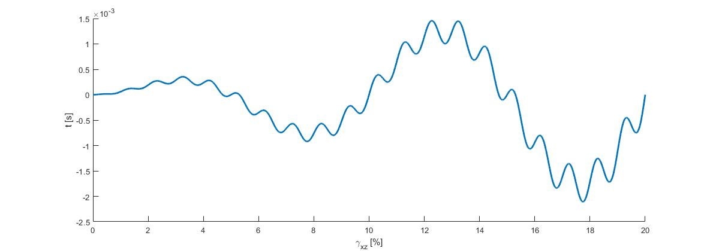
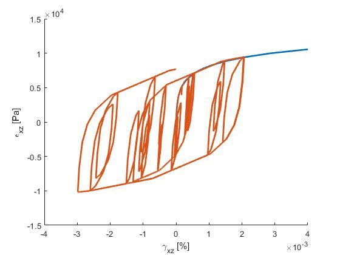

#   Validation test for Iwan law 

Iwan law is used for modeling the non-linear behavior in soil dynamics. PSD provides this law by its MFront interface. In this file the results and other key information concerning the validation numerical experiments conducted for PSD-MFront Iwan law is presented. 

### INTRODUCTION ###
The plastic soil behavior of iwan according to \citep{simo2006computational} is adobted. it demands only the reduction curve of the shear coefficient and the density of the soil both accessed easily by simple laboratory tests. The rheological formulation is in terms of total stresses and The plasticity model uses von Mises yield surface that assumes pressure-independent behavior both are acceptable in undrained conditions.


In (Fig. \ref{fig1}) the 1-D version of the stress-strain is illustrated it is composed of a series of paralell $N_s$ linear springs and friction units of stress threshold $Y_i$, calibrated to reproduce the stress-strain behavior measured in the laboratory. Each friction unit remains locked until the stress on it exceeds its stress threshold  $Y_i$, then it yields and the stress on it during yielding is equal to its yielding stress.


The soil behavior is assumed adequately described by a hyperbolic stress-strain curve \citep{hardin1972shear}. This assumption yields a normalized shear modulus decay curve, expressed as $\frac{G}{G_0}= \frac{1}{(1 + | \frac{\gamma}{\gamma_r} |)}$, where $\gamma_r$ is a reference shear strain corresponding to an actual tangent shear modulus equivalent to 50 \% of the elastic shear modulus, in a normalized shear modulus decay curve provided by laboratory test data  (Fig. \ref{fig2})


In this exemple, the Poisson’s ratio is assumed constant during the time history and, consequently, the normalized decay curve of the elastic modulus in compression is $\frac{E}{E_0}=\frac{G}{G_0}$ \citep{fares2018techniques}.The nonlinear behavior is characterized providing the evolution of the backstress  $C_i$ and the yield strength $Y_i$ associated with the $i^th$ mechanism, deduced by the compressive modulus reduction curve. If resonance column tests provide shear modulus decay curves $\frac{G}{G_0}(\gamma)$, the demanded first loading curve is evaluated as $\sigma(\epsilon)=\frac{E}{E_0}(\epsilon) E_0\epsilon$, where the axial stress $\sigma(\epsilon)$ can be calculated from shear stress $\tau(\gamma)$ as $\sigma(\epsilon)=\sqrt(3) \tau(\gamma))$, $\frac{E}{E_0}(\epsilon)$ is the normalized decay curve of elastic modulus in compression versus axial strain $\epsilon$ that is assumed equal to $\frac{G}{G_0}(\gamma)$ and $\epsilon=\sqrt(3)\gamma \frac{G_0}{E_0}$. 


Hence,$\tau(i)=\frac{G_0}{1+|\frac{\gamma(i)}{\gamma_ref}|}$, where  $\gamma_ref$ is the reference shear strain corresponding to a $\frac{G}{G_0} = 0.5$, $Y_i=\sqrt(3)\tau_i$  and $C_i=\frac{1}{\frac{\epsilon_{i+1}-\epsilon_i}{\tau_{i+1}-\tau_i}-2aux}$ where $aux_1=\mu$ and $aux_{i+1}=1/C_i$. The parameters used in this exemples are provided in Tab. \ref{tab1} and Tab.  \ref{tab2}. \\




The hysteresis loop that this model produces for $N_s=16$ is shown in Fig. \ref{fig4}. It illustrates the stress-strain response of a unit cube of soil  Fig. \ref{fig3a}, with a shear modulus decay curve represented in Fig. \ref{fig2}, subjected to cyclic one-component shear strain loading (Fig. \ref{fig3b}) of increasing amplitude.

### CONSTITUTIVE LAW ###


### Facts ###

- $\epsilon_{i,j}^{MFront} = (1/\sqrt{2}) \epsilon_{i,j}, \quad i\ne j$
- $\sigma_{i,j}^{MFront} = (1/\sqrt{2}) \sigma_{i,j}, \quad i\ne j$
- $\epsilon_{i,j}^{MFront}  = (1/\sqrt{2})\gamma_{i,j}^{CAST\epsilon M} , \quad i\ne j$

### Notes ###

- decimal problem does not seem to be effected if values of $C[N_s]$ and $Y[N_s]$ are input in MFront file or via PSD interface or CAST3M interfaces.  Decimal issue is linked to MFrnot PSD, C++, or CAST3M has no say in it. 

- `test.mtest` file is added to the directory along with the input file `gxz.csv`

  **to build the iwan law files locally**

  ```bash
  mfront --obuild --interface=generic ./../../../src/plugins/mfront/law/Iwan.mfront
  ```

  **to run the mtest**

  ```bash
  mtest test.mtest
  ```

  

## To Do
- Complete the file with maths behind (ongoing)

  
